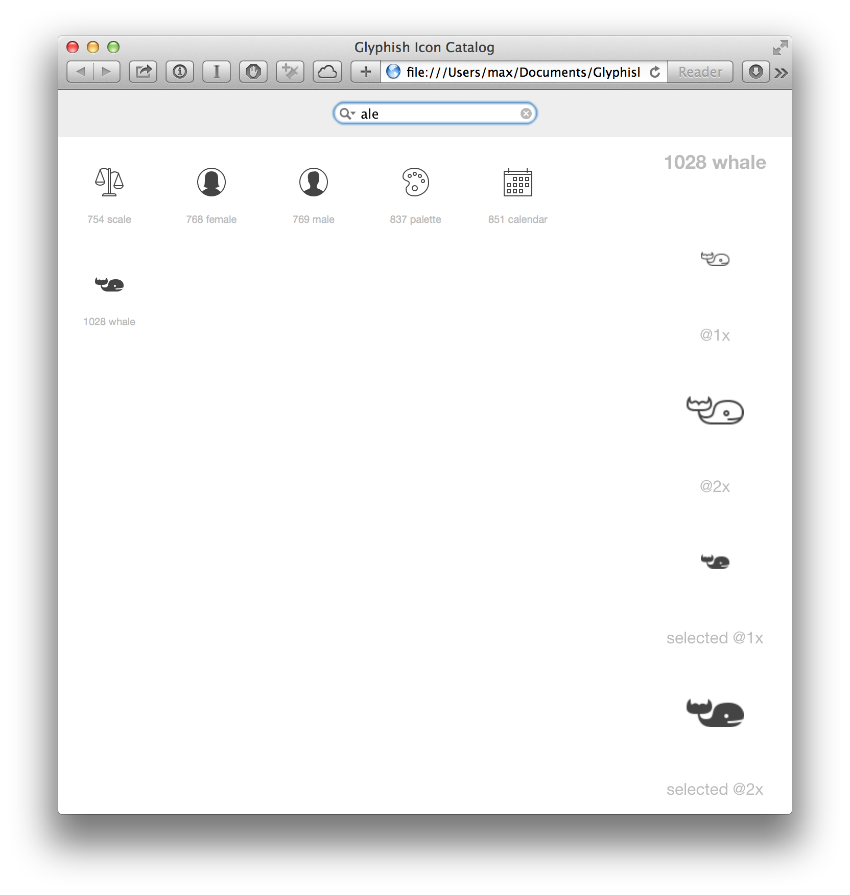

Glyphish-Preview
================

Standalone HTML to catalog your glyphish icons collection. Icons sold separately.

Let's you search your catalog for names or icon IDs, preview selected / unselected states and presents all images so you can easily drag them into your XCode Project.

How it works:

- clone this repository to your disc
- move your Icon directory to the cloned folder
- `~$ sh ./create_icons_js.sh`
- open index.html

Have fun!